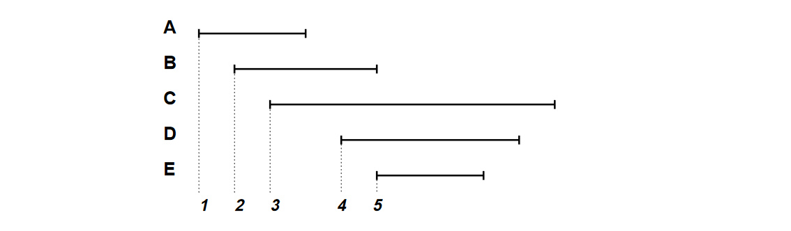

# 线性扫描寄存器分配（1）：基础介绍

视频地址：[Bilibili](https://space.bilibili.com/1535266/video)

这里所讲的内容主要来自于<a href="#ref-1">[1]</a>，也就是最为基础的线性扫描寄存器分配方案，可以做到线性时间内进行寄存器分配，比起图着色分配是一种快的多的分配方案。

## 步骤

首先来介绍最基础的线性扫描分配器，大致分为下面：

1. 计算出每个虚拟寄存器的活跃区间（Live Interval），根据活跃区间的起点进行排序。
2. 从前到后进行扫描活跃区间列表。
2. 进行分配并处理spill。

下面开始详细说明每个步骤如何进行操作。

### 计算活跃区间

首先对活跃区间进行计算。首先需要对指令进行一个编号，一个简单的方法是对指令进行深度优先标号（Deep First Numbering, DFN）。在进行了编号之后，通过活跃分析（live analysis）确定每个虚拟寄存器在程序的那些位置是活跃的，然后选出编号最大（$j$）和最小（$i$）的活跃点，组成活跃区间$[i,j]$。$v$的活跃区间只需要保证在这个区间之外$v$不会活跃就行了，不需要保证$v$在这个区间内是处处活跃的，这句话的意思在**Fig 1**能够体现出来。

<div style="display:flex; flex-direction:row; justify-content:space-around; align-items:flex-end">
	<div>
		
		<center><b>(a) 深度优先编号</b></center>
	</div>
	<div>
		
		<center><b>(b) 活跃区间</b></center>
	</div>
</div>


<center><b>Fig 1. 两个例子</b></center>

如果两个虚拟变量的活跃区间发生了重叠，那么可以称这两个虚拟变量存在冲突，产生了冲突的两个变量不可以使用同一个寄存器，类似于**Fig 1(b)**中两个区间，就发生了重叠，那么就不可以使用同一个寄存器了。

这里需要提到的是，对指令的编号会影响到代码生成的质量，因为在有些编号下活跃区间会更加短，更短的活跃区间会降低冲突的可能性<a href="#ref-3">[3]</a>。比如下面的例子中，`then`分支使用了$v$，但是`else`分支并没有使用v，同时`then`中的使用是最后一次使用，给`then`先编号会得到**Fig 3(b)**的结果，而给`else`先编号则会得到**Fig 3(a)**的结果。



<center><b>Fig 2. 一个if-then-else控制流，其中v只在then中被使用</b></center>



<center><b>Fig 3. 两种不同的编号方式</b></center>

很容易发现，一些活跃区间会出现类似于**Fig 3(a)**的空洞，如果另外一个活跃区间正好在这个空洞里面，就不会发生冲突，不过我们这里并不利用这种空洞，而是简单地将活跃区间从头到尾当成一个整体。

### 对活跃区间线性扫描

接下来对活跃区间进行扫描，在进行扫描之前首先对所有的活跃区间进行排序，根据区间开始点从低到高。排序后的活跃区间很适合进行线性扫描，对活跃区间的迭代的顺序和标号顺序是一样的。

下面开始，假设一共有$R$个可供分配的寄存器。有一个链表$active$，用于存放覆盖了当前位置的活跃区间，$active$根据每个区间的终点从高到低进行排列，反过来也行，这样有利于减少查找的次数。

每次向前扫描可以遇到一个新的活跃区间$I_{new}$，用$I_{new}$的起点$i$和$active$链表中的每个区间$I_{old}$的终点$j$进行对比，如果出现了$j \le i$，那么就将$I_{old}$从$active$中移除，这个时候可以认为$I_{old}$以及被完全处理了，不需要再次进行考虑。

再进行了对$active$的更新之后，如果$size(active) \ge R$那么此时必须要将链表中的某个$I_{old}$或者是$I_{new}$进行spill，可以使用多种方式决定到底需要将那个区间进行spill，这里给出一个heuristic，就是使用结束位置最后的一个区间进行spill，这么做的原因是，因为结束的位置最后，所以会延续很长因此可能会导致更多的区间被溢出，如果使用了区间的终点从高到低进行排列，那么$active$中最后结束的就是第一个。除此之外还可以通过区间的使用频率的等信息进行判断。

**Fig 4**是一个来自<a href="#ref-1">[1]</a>的例子，一共有两个可用的寄存器，即$R=2$。



<center><b>(a) 五个活跃区间，其中B和E首位相连</b></center>

|      | active intervals  | available registers | spilled intervals |      allocation results       |
| ---- | :---------------: | :-----------------: | :---------------: | :---------------------------: |
| 初始 |      $\{\}$       |    $\{r_1,r_2\}$    |      $\{\}$       |            $\{\}$             |
| A    |    $\{A=r_1\}$    |      $\{r_2\}$      |      $\{\}$       |            $\{\}$             |
| B    | $\{A=r_1,B=r_2\}$ |       $\{\}$        |      $\{\}$       |            $\{\}$             |
| C    | $\{A=r_1,B=r_2\}$ |       $\{\}$        |      $\{C\}$      |            $\{\}$             |
| D    | $\{D=r_1,B=r_2\}$ |       $\{\}$        |      $\{C\}$      |          $\{A=r_1\}$          |
| E    | $\{D=r_1,E=r_2\}$ |       $\{\}$        |      $\{C\}$      |       $\{A=r_1,B=r_2\}$       |
| 结束 |      $\{\}$       |    $\{r_1,r_2\}$    |      $\{C\}$      | $\{A=r_1,B=r_2,D=r_1,E=r_2\}$ |

<center><b>(b) 每次迭代后的结果</b></center>

<center><b>Fig 4. 一个典型的例子</b></center>

### 进行分配和处理spill

一个区间进行了spill之后，就不再占有任何一个寄存器了，但是在使用点依旧需要对寄存器进行使用，所以在使用点可以使用任意一个寄存器，临时寄存器的选取只要保证即可不和指令内其他寄存器重复即可。此时，需要为虚拟变量在栈上分配一个空间，在对虚拟变量进行赋值之后要将值回存到栈上的空间。由于需要占用其他寄存器，那么可能会破坏寄存器中的值，所以还需要另外一个栈上的空间能够存放被临时占用的寄存器的值。

下面的例子来对spill的结果进行展示：

```
......
move 10, a // a = 10
......
add a, b, c // c = a + b
......
move a, w // w = a
......
move 13, a // a = 13
......
```

这里假设`a`被溢出了，在栈上分配了两个位置（`m1`、`m2`），而其他的变量（`b`、`c`、`w`）均被分配到了寄存器（`r1`、`r2`、`r3`），那么在对这个程序进行改写之后得到的程序如下：

```
......
store r1, m2
load m1, r1
move 10, r1 // a使用r1
store r1, m1
load m2, r1
......
store r3, m2
load m1, r3
add r3, r1, r2 // a使用r3
store r3, m1
load m2, r3
......
store r1, m2
load m1, r1
move r1, r3 // a使用r1
store r1, m1
load m2, r1
......
store r1, m2
load m1, r1
move 13, r1 // a 使用r1
store r1, m1
load m2, r1
......
```

用这个方法来处理spill确实不是很好，但是却很直观，对于spill有很多可以优化的地方，插入spill代码的方式对于性能的影响很大，由于这里的最简单的情况，所以就不介绍有关spill代码的优化了，其实看上面的例子也能看出来有好几个直观的改善方式，比如被溢出的变量作为`move`指令的目标的时候，根本不会用到它的值，所以可以将`move`改写为`store`，直接将值存入栈中，不过这些都需要更加复杂的rewriter。

### 调用规约和寄存器预分配

在一些架构上，有的指令必须要使用某个特定的寄存器，`return`可能必须使用`v0`来存放返回值。为了保证`return`语句一定可以使用的了`v0`寄存器，需要预先进行寄存器分配，也就是生成的`return`不应该使用虚拟寄存器（`return r0`）而是直接使用物理寄存器（`return v0`）。然后在原有的活跃区间中加入被预先分配了的物理寄存器的活跃区间，物理寄存器活跃区间的计算方式和虚拟寄存器是一样的。

虽然物理寄存器的处理方式和虚拟寄存器类似，但是，按照之前给出的对溢出的处理方式来看，物理寄存器的是不允许进行溢出的，因为在进行了溢出之后无法保证原有的指令能够继续使用预分配的寄存器，比如有下面的情况：

```
add a, b, r0
// 将r0溢出了，将r0分配给了a。
add r0, r1, r0
// 发生了冲突。
```

说完了如何进行寄存器的预分配，来说说调用规约的实现。对于模拟callee-saved寄存器来说，可以在方法的入口处存在对callee-saved寄存器的定值，在方法的出口处存在对callee-saved寄存器的使用，这样，就会产生一个横跨整个方法的活跃区间，同时预分配的寄存器不能溢出，会导致callee-saved寄存器实际上不能被使用。最简单的解决方式是，对所有在方法中被使用的callee-saved寄存器，在入口处保存到栈中，在出口处恢复。

模拟caller-saved寄存器，则需要让call指令使用所有的caller-saved寄存器进行模拟，由于预分配寄存器不允许进行spill，那么在处理call指令时会将使用了caller-saved寄存器的跨调用活跃区间全部溢出，会对产生非常多的load/store指令，更加糟糕的是，如果方法内存在多个调用点，那么对caller-saved寄存器的使用会连起来，导致很大一个范围内都无法使用caller-saved寄存器，基础的线性扫描不能很好地解决这个问题。

为了缓解这个问题，可以考虑将所有的跨调用存活的变量存入到栈中，调用结束后加载到另外的虚拟变量中，这样相当于将区间截断为两个了，不过这样很麻烦，要进行重命名。或者是不对caller-saved行为进行模拟，也就是call指令不不使用它们，而是在每个call之前保存所有的caller-saved寄存器，调用结束之后进行恢复。如果要实现一个线性扫描寄存器分配的话选第二种方案就好了。

## 解释几个可能的问题

### 为什么是线性的？

因为按照了活跃区间的先后顺序进行的扫描，所以叫做线性扫描，上面的算法就是按照了每个活跃区间的开始处位置进行了排序然后再进行的扫描，也不会进行任何回溯。同时线性扫描寄存器分配的时间复杂度也是线性的。

### 有没有非线性的？

有的，可以给每个活跃区间一个优先级，然后按照优先级顺序进行扫描，比如先给所有活跃区间短，但是可能使用次数较多的的虚拟变量更高的优先级，使其先被分配。LLVM中的[Basic和Greedy](https://blog.llvm.org/2011/09/greedy-register-allocation-in-llvm-30.html)寄存器分配使用的就是基于spill weight进行排序的优先队列进行的。

### 为什么说会比图着色寄存器分配速度更加快？

因为线性扫描分配器没有构建一个全局的冲突图，而是使用了局部的冲突信息，也就是只关注了当前进行分配的live interval和当前active列表中或者inactive列表中的冲突，另外不会像图着色分配器一样反复地构建冲突图。

## 引用

<span id="ref-1">[1]</span>. M. Poletto和V. Sarkar, 《Linear scan register allocation》, *ACM Trans. Program. Lang. Syst.*, 卷 21, 期 5, 页 895–913, 9月 1999, doi: [10.1145/330249.330250](https://doi.org/10.1145/330249.330250).

<span id="ref-2">[2]</span> C. Wimmer和H. Mössenböck, 《Optimized interval splitting in a linear scan register allocator》, 收入 *Proceedings of the 1st ACM/USENIX international conference on Virtual execution environments - VEE ’05*, Chicago, IL, USA, 2005, 页 132. doi: [10.1145/1064979.1064998](https://doi.org/10.1145/1064979.1064998).

<span id="ref-3">[3]</span> C. Wimmer和M. Franz, 《Linear scan register allocation on SSA form》, 收入 *Proceedings of the 8th annual IEEE/ ACM international symposium on Code generation and optimization - CGO ’10*, Toronto, Ontario, Canada, 2010, 页 170. doi: [10.1145/1772954.1772979](https://doi.org/10.1145/1772954.1772979).

