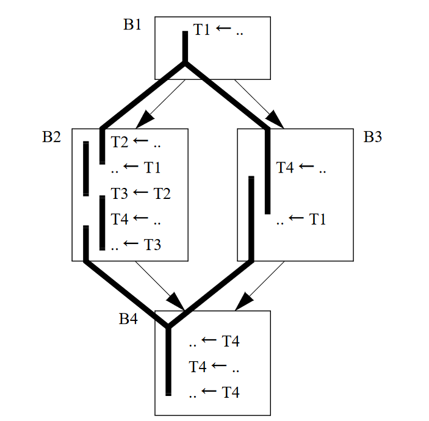
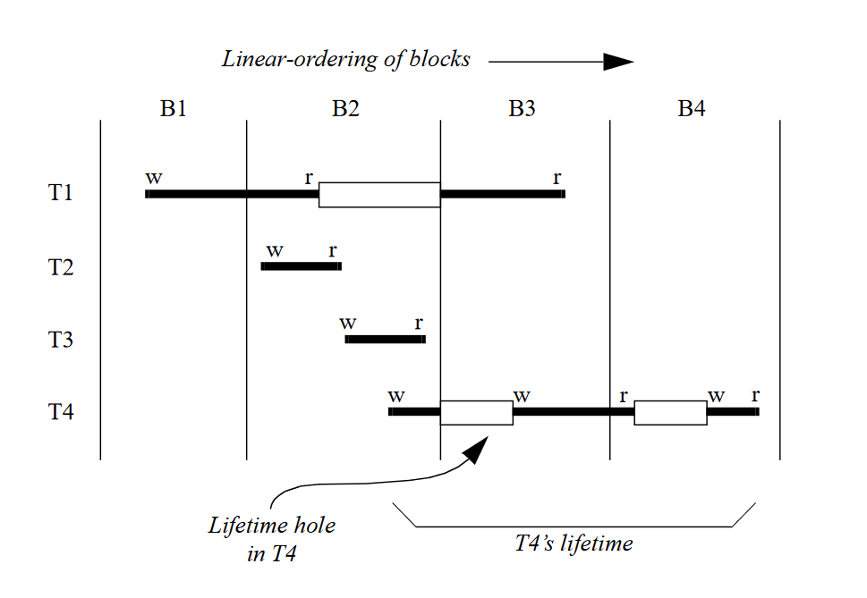
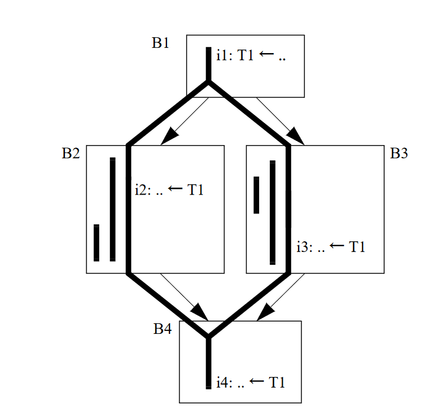
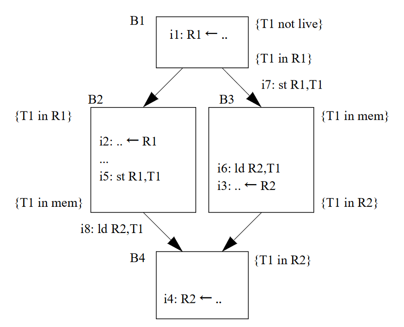

# 线性扫描寄存器分配（2）：利用live interval hole进行改进

下面的主要内容来自于*Traub et al.*的<a href="#ref-1">[1]</a>，会详细的说明如何利用hole和interval split来改善寄存器分配的质量。另外，Hotspot的C1编译器也很大程度上借鉴了这个算法进行寄存器分配，只是细节上有所不同<a href="#ref-4">[4]</a>，在下次的内容中会说说C1具体是怎么做的，并且给出一个对比。

## 利用hole和对interval进行分割

在上次的内容中，我们了解了如何使用线性扫描来对寄存器进行分配，但是通过观察我们可以很快发现，如果我们让分配器可以利用活跃区间的下面两个特性，那么我们分配的质量就会明显提高。

### interval的空洞（hole）

如下图中的两个interval，灰色的部分就是空洞（hole），根据之前讲过的构建interval的方法，可以知道如果出现了write，那么会导致interval出现空洞，因为write会将原本的值杀死。



如果可以利用hole，那么上下两个interval是不会产生冲突的，而按照在**线性扫描寄存器分配（1）**给出的方案，这里会产生一个冲突。为了支持这种方式，我们需要将interval进行进一步划分，每个连续的范围称为一个range，那么现在一个interval由一个或多个range组成。

### 将interval进行拆分（split）

除了对hole的利用之外，如果可以支持一个interval存储在多个位置（location），也可以提高分配的质量。比如下面这两种情况：



这里，我们让$interval_1$保存在了2个位置，一部分在$R_1$，另外一部分在内存，这样就可以让$interval_2$也可以使用$R_1$了，我们可以假定保存在Stack的那一段没有使用点，可以不用寄存器，而$interval_2$有使用点必须要寄存器。所以，我们能够使用1个寄存器满足两个interval的需要。

另外一种情况是：


如果一共有两个可以分配的寄存器，$R_1$和$R_2$。$interval_1$最先被处理，分配了$R_2$，下一个被处理的是$interval_2$，分配了$R_1$，但是到了$interval_3$时没有寄存器可用，但是如果我们将$interval_2$的第二个range，暂时取消分配，释放$R_1$，那么$interval_3$便可以分配到$R_1$了，等我们后面再来处理分割出来的部分时$R_2$又是空闲的了，所以分配成功。

上面的情况都表明，如果我们能够使用hole以及对interval保存在多个location，那么寄存器的利用率就会提高。为了支持这种做法，可以将一个interval进行拆分（split），将一个interval变为多个interval，那么每个interval依旧是在一个固定的location，保持了一个interval一个location，可以让实现更加简洁清晰：

也就是说如果我们有如下的interval，interval1：


被拆分之后就会变为三个interval，interval 4、5、6：


这里其实产生了类似于回溯的效果，被处理过的interval被截断了一部分，成为新的interval，然后的得到了二次处理，所以这个方法也可以叫做Second-chance allocation。

## 构建live interval

构建live interval的方法在之前的[视频](https://www.bilibili.com/video/BV1NS4y1F76w)讲到过，但是里面有个地方有问题，就是对于类似下面这种情况：

```
Block:
	......
	store V7, ...
	......
	store V7, ...
	......
V7在Block的出口不活跃
```

也就是出现了一个未使用的定义。在原来的算法中，这个使用会被忽略掉，其实我们应该插入一个长度为1的range，来表示它这里确实存在一个write操作，可能需要分配一个寄存器（有的体系结构下write的target可能不是寄存器），也就是得到这样的结果：


## 遍历IR

首先对基本块进行一个排序，使得基本快成为线性的，然后对线性的基本块进行遍历，如果新遇到了一个虚拟变量的使用或者定值，那么就需要尝试给虚拟变量分配，并且在遍历的过程中对虚拟变量进行替换，也就是说，在分配的时候给$V_1$分配了寄存器$R_1$，那么只要分配的结果没有改变，在后续的IR指令中凡是出现了$V_1$的地方都需要替换为$R_1$，*Traub et al.*给出的方案中并没有独立的rewriter，分配和改写是同时进行的。

分配在当前的遍历到的虚拟变量没有被分配的情况下发生，在出现了活跃的interval过多的情况下，那么此时就需要进行split和spill，当前扫描位置之前分配的结果并不会被改变，只会改变被拆分下来的新interval，所以split的点只能是当前扫描到的点。在对interval进行拆分后产生了新的interval（记为$I_{new}$）后，如果split的点不在hole中，那么在下一个扫描位置就要处理$I_{new}$，$I_{new}$可能分配到寄存器，也有可能被溢出到内存，这个主要是根据溢出的代价来就行判断的。总之，新产生的interval的处理方式和原有的interval是一模一样的。

这个算法从概念上还是比较简单的，对于split位置的选择是比较死板的，而split对于生成的分配结果的质量影响很大。

给出一个例子进行演示，假设一共有两个寄存器$R1$、$R2$可供分配，为了方便说明，使用ppt动画（动图.pptx）进行演示，看看是如何进行遍历的。

## 解决location冲突（resolve）

既然允许了将一个interval拆分成多个，同时每个拆分出来的interval都可能在不同的location，那么就会出现不一致（inconsistent），在某些部分可能分配了寄存器$r0$，而有些部分可能分配了寄存器$r1$，而其他部分可能被溢出到了内存，为了解决这种不一致，需要加入一些移动指令或者存取指令来解决这些不一致。



<center><b>Fig 1</b></center>

**Fig 1**中三个interval是从同一个interval拆分来的，但是在不同的location，这样就会产生不一致，比如在某一段代码中，虚拟变量使用了R1，而在另外一段中使用了R2，那么肯定就会出错。

这种冲突可以分为局部的（基本块内）和全局的（基本块间），因为假设我们在分配过程中已经生成了合适的指令处理基本块内的冲突，在这里只需要对全局的冲突进行处理即可。另外，因为没有保存任何关于局部冲突的信息，所以难以在后面的阶段对局部冲突进行处理，下面就来说说如何解决全局的冲突。

在上面提到过的遍历过程中，我们需要保存每个基本块开头和末尾的分配结果，其中一个基本块开头的结果是线性列表中前一个基本块末尾的分配结果，如**Fig 2**中的结果。



<center><b>Fig 2.B1->B2->B3->B4</b></center>

在分配的时候使用了线性的基本块列表，而在resolve的时候却要使用CFG。通过上面的CFG我们立刻能够发现分配的结果之间发生了冲突，因为有边$B1 \to B3$，所以我们要保证B1末尾处T1中的值出现在指定的内存位置，这样，在B3中进行加载的时候才能够获得正确的值，也就是说需要在B1的末尾处或者B3的开头处放置一个存储指令，将值保存到内存中。

我们称前驱的分配结果为from，后继的分配结果为to，存在以下几种可能性：

1. from和to在同一个寄存器里面。什么也不用做。
2. from和to不在同一个寄存器里面。插入一条move指令。
3. from在寄存器，to在内存。插入一条store指令。
4. from在内存，to在寄存器。插入一条load指令。
5. from和to都在内存。什么都不用做。

插入位置的选择需要不干扰其他寄存器或者是内存，所以，当from块只有一个后继的时候，可以将代码插入在from块的末尾，如果to块只有一个前驱，那么可以将代码插入在to块开始，如果这里存在关键边（critical edge），那么需要进行关键边分割。我们可以发现有时候to块如果有多个前驱，那么interval可能就不是从to块开始处开始了，而from块有多个后继，那么interval可能就不是在from块结尾处结束了。插入的存取语句对性能有比较大的影响，但是由于此算法不能够控制split的位置，也就无法控制在什么地方插入存取语句导致了无法选取理想的插入位置（比如循环外），对于在什么地方就行split比较好，<a href="#ref-4">[4]</a>给出了一些策略。

可以利用基本块的LiveIn信息对插入进行引导，只有当一个虚拟变量属于to块的LiveIn才需要被处理，因为如果一个虚拟变量不属于LiveIn，那么要么是使用之前存在定值，要么是不再被使用了，这两种情况下都不需要做什么处理。另外使用LiveIn信息会简化插入的逻辑，因为如果虚拟变量是LiveIn的，那么说明不会存在hole，为什么？因为如果属于to块的LiveIn的，那么不会存在一个先定值后使用，这种情况会导致入口处到定值点的hole，另外，属于to块的LiveIn就属于from块的LiveOut，根据我们之前给出的的interval的计算方法，可以知道，从from块的某一点到出口一定是存在着interval而非hole的。论文中还给出了一些优化的方案以减少所需要的存取指令，不过这里就不说了。

## 例子

这里的例子是<a href="#ref-1">[1]</a>中给出的，前文已经使用过了，这里只是展现一下：

<div style="display:flex; flex-direction:row; justify-content:space-around; align-items:flex-end">
	<div>
		
		<center><b>(a) 一个CFG，黑色粗线标记的是活跃范围</b></center>
	</div>
	<div>
		
		<center><b>(b) 根据CFG构建的活跃范围</b></center>
	</div>
</div>

<center><b>Fig 3</b></center>

<div style="display:flex; flex-direction:row; justify-content:space-around; align-items:flex-end">
	<div>
		
		<center><b>(a) 一个类似的CFG，不过只关注了有关T1的指令</b></center>
	</div>
	<div>
		
		<center><b>(b) 分配结果</b></center>
	</div>
</div>

<center><b>Fig 4</b></center>

我认为**Fig 4(b)**的图印错了，在B4，R2应该是作为source才对。

## 结尾

在这篇文章中我们只说了原理，所以很短，因为我并没有实现*Traub et al.*的算法，我实现的是类似于C1使用的算法，所以一些实现的细节在下一篇里面。我觉得C1的算法会更加好实现一些优化。

## 引用

<span id="ref-1">[1]</span> O. Traub, G. Holloway和M. D. Smith, 《Quality and speed in linear-scan register allocation》, 收入 *Proceedings of the ACM SIGPLAN 1998 conference on Programming language design and implementation - PLDI ’98*, Montreal, Quebec, Canada, 1998, 页 142–151. doi: [10.1145/277650.277714](https://doi.org/10.1145/277650.277714).

<span id="ref-2">[2]</span> C. Wimmer, 《Linear Scan Register Allocation for the Java HotSpot Client Compiler》, 页 133.

<span id="ref-3">[3]</span> T. Kotzmann, C. Wimmer, H. Mössenböck, T. Rodriguez, K. Russell和D. Cox, 《Design of the Java HotSpotTM client compiler for Java 6》, *ACM Trans. Archit. Code Optim.*, 卷 5, 期 1, 页 1–32, 5月 2008, doi: [10.1145/1369396.1370017](https://doi.org/10.1145/1369396.1370017).

<span id="ref-4">[4]</span> C. Wimmer和H. Mössenböck, 《Optimized interval splitting in a linear scan register allocator》, 收入 *Proceedings of the 1st ACM/USENIX international conference on Virtual execution environments - VEE ’05*, Chicago, IL, USA, 2005, 页 132. doi: [10.1145/1064979.1064998](https://doi.org/10.1145/1064979.1064998).

