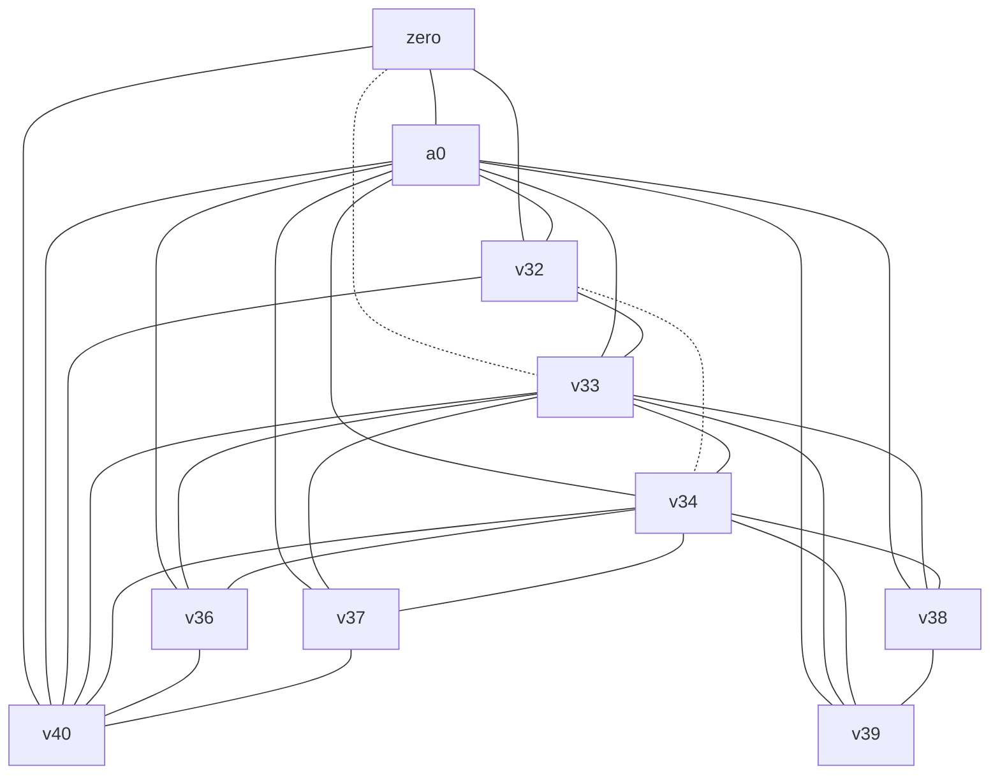
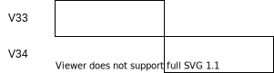

# 图着色寄存器分配

视频地址：[Bilibili](https://space.bilibili.com/1535266/video)

参考资料:

> 《Introduction to Compiler Construction in a Java World》 268-273
>
> 《Modern Compiler Implementation in C》235-264
>
> George, Lal. 《Iterated Register Coalescing》. *ACM Transactions on Programming Languages and Systems* 18, 期 3 (不详): 25.
>

这里说说图着色，先讲解原理，同时也提供了一个java语言的实现。

## 图着色问题

在介绍图着色寄存器分配之前，先来说一下图着色问题。下面是一个图：


图中一共6个结点，被边相连的结点表示有相邻的关系，有相邻关系的结点不可以被染成同一种颜色，这就好像给地图上给不同的国家用不同颜色进行标识一样，如果实用同样的颜色就无法进行区分了。

假设一共有红绿蓝3种颜色可供选择，那么一个可能的染色的结果如下：


只需要能够保证一条边连接的两个节点使用了不同颜色即可，如果可以用3个颜色来进行着色，那么可以称此图为3可着色图。具体的染色过程如下：

将度低于3的结点删除，同时有关的边也进行删除，加入栈中，这里删除了a：


重复上面的操作，直到所有结点放入了栈中，此时图已经为空：


这个过程被称为简化，简化并不会改变图的可着色性，不可着色的依旧是不可着色的。

然后从栈中将结点取出，取出时进行着色，f染为红，接着c出栈，c染为绿，同时，在原图中c和f有连接关系，这里将2者连接起来：


重复上面的思路继续往下，注意，如果两者有连接关系，那么不可以染成同样的颜色：


## 利用图着色进行寄存器分配的思路

分配寄存器也是类似的思路，图中的结点可以被看作是中间代码中的虚拟寄存器（或者叫临时变量，这里就叫做变量好了），而颜色可以被看作是物理寄存器，每个物理寄存器对应一种颜色，分配物理寄存器就是对结点进行着色。而结点之间的边代表了两个虚拟寄存器的冲突也就是两个虚拟寄存器不可以分配到同一个物理寄存器，因为这两个虚拟寄存器时同时活跃的。

计算live interval的方法之前已经给出过了，如果两个变量的live interval之间有重叠那么两个变量之间需要一个边进行连接，因为图描述了变量之间的live interval的冲突关系所以叫做冲突图（interfere graph），而将结点不断从图移除到栈中的行为叫做简化（simplify）。

下面是一段java代码，以及其对应的IR（Intermediate Representation）

```java
import jminusminus.SPIM;

public class Fibonacci {
    // Entry point.
    public static void main(String[] args) {
        int a = 0;
        int b = 1;
        while (1000 > b) {
            SPIM.printInt(b);
            SPIM.printChar('\n');
            int t = a;
            a = b;
            b += t;
        }
    }
}
```

IR：

```
B0
 
  
B1
0: LDC [0] $zero  
5: LDC [1] [V32|I]  
10: MOVE $zero [V33|I]  
15: MOVE [V32|I] [V34|I]  
  
B2
20: LDC [1000] [V36|I]  
25: BRANCH [LE] [V36|I] [V34|I] B4  

B3
30: MOVE $a0 [V37|I]  
35: MOVE [V34|I] $a0  
40: INVOKESTATIC jminusminus/SPIM.printInt( $a0 )  
45: MOVE [V37|I] $a0  
50: MOVE [V33|I] [V35|]  
55: MOVE [V40|I] [V34|I]  
60: MOVE [V34|I] [V33|I]  
65: LDC [10] [V38|I]  
70: MOVE $a0 [V39|I]  
75: MOVE [V38|I] $a0  
80: INVOKESTATIC jminusminus/SPIM.printChar( $a0 )  
85: MOVE [V39|I] $a0  
90: ADD [V34|I] [V33|I] [V40|I]  
95: BRANCH B2  
```

求出的活跃区间为：

```
zero: [0, 10]
a0: [0, 95]
V32: [5, 15]
V33: [10, 50] [60, 95] 
V34: [15, 35] [55, 95] 
V35: 
V36: [20, 25]
V37: [30, 45]
V38: [65, 75]
V39: [70, 85]
V40: [0, 55] [90, 95]
```

那么可以画出这样一个图来：


上面说过，虚拟寄存器之间的边就是live interval产生了重叠，所以live interval可以画出对应的冲突图来：



一个可能的疑问是，两个interval，它们的开始和结束恰巧在一起，算不算冲突呢：



需要分情况，如果是：

```
ADD [V32|I] [V33|I] [V34|I]
```

不算是一个冲突，因为可以让`V33`和`V34`使用同样的寄存器。

如果是：

```
MOVE [V33|I] [V34|I]  
```

一样的情况也不是，因为是从一个虚拟寄存器将值移动到了另外一个虚拟寄存器中，也就是说，在进行分配的时候两个虚拟寄存器可以分配为同一个寄存器，更进一步的，这个move语句也可以被省略掉，假设`V34`分配了`$t0`寄存器，`V33`分配了`$t0`寄存器，上面的语句翻译为mips汇编：

```mips
move $t0, $t0
```

这种关系被称为移动关联（move-related），在图中可以使用虚线表示，也就是在上图中所展示的一样，move-realated的结点使用了虚线进行连接，move-related的两个结点事实上时可以合并为一个的，也就是两者会被染上同一个颜色。

## interval coalescing

对move-related的结点进行合并的动作叫做interval coalescing，区间合并，结果是两个区间进行组合变成了一个区间，不过将interval进行合并会导致产生一个生命周期更加长的interval，从而对寄存器分配造成压力产生更多的spill，如果因为删掉一个复制语句而新增spill就得不偿失了，因为访存速度会慢很多。


在上图中，新产生的`V33&V34`有的冲突数量增多了。

所以在进行折叠之前需要一些判断，比如说使用briggs的conservative heuristic：如果合并之后产生了结点N，N的邻居中，度大于等于R的邻居数量少于R个，那么合并时安全的，不会将可着色的图转为不可着色的图。这是因为，对于N的邻居来说，度只可能时减小或者不变，由于度大于等于R的邻居少于R个，那么N也是可简化的，也就没有给N的邻居带来新增的不可简化的邻居。

如果一个结点有move-related的邻居，但是不能进行合并，那么将这个结点进行freeze操作，放弃进行合并，也就是和这个结点有move-related关系的结点不再有move-related关系，在接下来的处理中使用其他的处理方式来处理这个结点：


并不是每一对move-related的结点都可以被合并，如果两者之间存在了move-related又存在冲突，那么这被称为受限的（constrained）。考虑一个图有x,y,z三个结点：


其中，x和z冲突，x和y、y和z存在move-related关系，在进行了x和y合并之后，情况就会变成：


这种情况是无法进行合并的，所以将这里的move-related关系忽略掉，而是进一步进行简化，将`x&y`或者`z`取走。

## spilling

寄存器分配时往往出现一些不可着色的图，这就需要进行溢出（spilling）。

如果出现了一个结点，其度$\ge$R，R是可分配寄存器的数量，那么此结点有可能无法分配到寄存器，不过不是一定无法分配到，因为虽然结点的度$\ge$R但是，邻居结点的颜色可能会有重合，那么这样就没问题了，所以在将一个度$\ge$R的结点放入栈时，先假设它只是可能溢出的，等到出栈进行颜色分配时，如果邻居用完了所有颜色，那么这个时候溢出才真正发生。


进行溢出就是让这个虚拟寄存器中的值保留在栈中而不是保留在物理寄存器中，只有在使用的时候才取出来。在被使用的时候需要指派一个寄存器来装载内存中的值，所以在使用点也需要被分配一个寄存器，还需要在IR中插入有关的存取指令，虽然依旧需要使用寄存器，但是实际上新加入的虚拟寄存器的活跃区间非常短，所以对寄存器分配产生的压力也小。


<center>进行spilling前后对比</center>

同时IR也需要被更新，假设IR如下：

```
ADD [V32|I] [V33|I] [V34|I] // V34 = V32 + V33
```

如果`V32`和`V34`被溢出了，需要修改为（`V32_1`代表$V32_1$）：

```
LOAD [V32_1|I] [Stack]
ADD [V32_1] [V33|I] [V34_1|I] // V34_1 = V32_1 + V33
STORE [V34_1|I] [Stack]
```

在加入了新指令同时也增加了新的一些变量，那么需要给这些变量也分配寄存器，需要根据新的IR重新构建一个冲突图，反复进行上面的步骤。

## 迭代过程

下面说明这个是如何进行的：


<center>出自《Modern Compiler Implementation in C》240页</center>

《Modern Compiler Implementation in C》即是著名的“虎书”已有中文版，直接看中文版即可，里面的内容主要出自作者的一篇论文《Iterated Register Coalescing》，论文中有具体实现的伪代码，如果需要实现可以参照伪代码进行实现，论文和书中内容有一定出入，在conservative coalescing的条件上，论文和书表述不一致，以书为准即可。

## 预着色

在生成IR的时候，有一些指令需要特定的寄存器，就会直接使用物理寄存器，比如在进行调用的时候：

```
70: MOVE $a0 [V39|I]  
75: MOVE [V38|I] $a0  
80: INVOKESTATIC jminusminus/SPIM.printChar( $a0 )  
85: MOVE [V39|I] $a0 
```

`$a0`时用来传递变量的寄存器，在进行调用之前，需要将参数放入`$a0`进行变量传递。

这些固定的寄存器也需要存在于冲突图中，但是这些固定的寄存器不需要分配，在进行简化的过程中，无法被简化，只需要对那些为分配寄存器的变量进行简化，所以简化的过程不是在所有的结点都消去后停止，而是只剩下预分配结点之后停止。

预着色寄存器的存活范围应该尽可能的小，否则会产生许多的冲突。

## 调用规约

有一些寄存器是调用者保存的，而有些寄存器是被调用者保存的，如果一个函数需要使用一个被调用者保存寄存器，那么它有义务将这个寄存器恢复为进入函数时的样子，如果一个函数在调用另外一个函数的时候希望保存当前一个调用者保存寄存器中的值，那么这个函数就必须将这个寄存器中的值保存在某个位置，被调用者可能改变调用者保存寄存器中的值。

比如在mips中，$t0-$t9为调用者保存的，返回之后寄存器中值可能改变。同时，用于传递参数的寄存器，在mips上是$a0-$a3，也可能被修改，所以也是调用者保存的寄存器。$s0-$s7为被调用者保存的，返回之后能够保证寄存器中值不变，所以不需要特别处理。

那么在调用点存活的变量不可以被分配到这些调用者保存寄存器，尽量要分配被调用者保存寄存器，所以需要在冲突图中进行表达，让所有跨调用存活的变量和调用者保存寄存器冲突，这样就可以让跨调用存活的变量尽量分配到被调用者保存的寄存器了，不过，使用了被调用者保存寄存器也需要注意一点，因为对于当前过程的调用者来说，当前过程本身也是个被调用者，也就是说需要将被使用的被调用者保存寄存器中的值保存到其他地方，使用之后再恢复回来。


《Modern Compiler Implementation in C》再P244出了一个方法，认为被调用者保存寄存器是在入口处是定值，然后将其中值转移到一个变量中，在出口处是使用，进行恢复。如果`r7`没有被使用，那么`t231`就可能分配到`r7`那么（进行coalescing），就会变成一个无用的move，然后被删除掉，如果被使用了，因为`t231`是跨调用存活的，所以，更加可能分配到其他被调用者保存寄存器。

其实也可以无视调用规约，让编译出来的函数将所有寄存器当作被调用者保存的，这样在调用的时候就不需要考虑这个问题了，但是问题是，被调用者无法知道那些寄存器需要被保存，所以会保留全部的寄存器，速度慢。

如果需要遵守调用规约，那么最简单的方式是将每个函数调用点当作调用者保存寄存器的使用点，也就是在这些地方强制将使用了这些寄存器的变量进行溢出。
