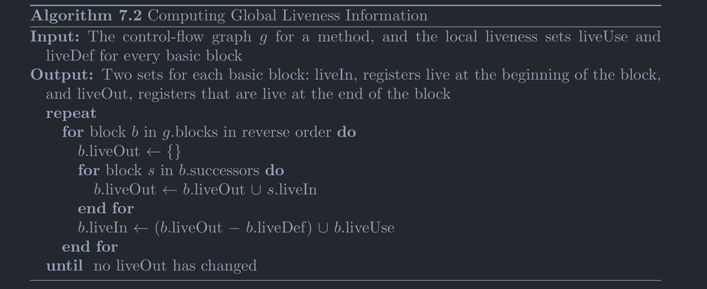
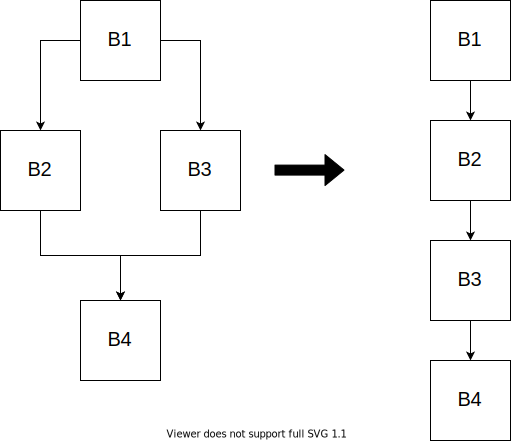

# 计算Live Interval

视频地址：[Bilibili](https://space.bilibili.com/1535266/video)

[TOC]

在寄存器分配的时候，无论时使用图着色还是线性扫描，都会用到live interval信息：


live interval的图示如上，可以看到其中有的变量被分开了几段，每一段是一个range，多个range组成了一个interval，从一个range的开始到结束，变量中的值始终没有被修改，最后一段range的结束点是变量使用的结束点（从编号来说），从此之后变量不再被使用，所以可以看出来这个信息对于寄存器分配是非常重要的。

下面说明一下如何计算得到这个信息。大致有3个步骤：

1. 计算基本块内的LiveUse、LiveDef。
2. 通过每个块内的LiveUse、LiveDef来计算每个基本块的LiveIn、LiveOut。
2. 通过每个基本块的LiveIn、LiveOut来计算live interval。

下面按照步骤来一步一步进行说明。

## 计算LiveUse和LiveDef

LiveUse和LiveDef是两个集合。

首先来介绍一个叫做使用点和定值点的概念，使用点就是一个变量作为运算数进行运算的点，而定值点就是变量被定值的点，比如：

```
a = b + c
```

其中的`b`和`c`是运算数，那么这条指令就是`b`和`c`的使用点，而`a`被定值了，那么这条指令就是`a`的定值点。

对于一个基本块来说如果从入口处到达变量V的某一个使用点没有经过V的定值点（也就是没有出现在LiveDef集合中），那么V就在LiveUse集合中。如果从入口处能够到达一个V的定值点，那么V就在LiveDef集合中，否则变量V在此基本块既没有被使用也没有被定值。

计算的方法是从头遍历每一条指令，然后遍历每个指令的操作数，如果操作数此时没有加入到LiveDef中则加入到LiveUse中，如果指令有对变量定值，那么将被定值的变量加入到LiveDef。

伪代码：

```
LiveUse <- {}; // LiveUse为空。
LiveDef <- {}; // LiveDef为空。
for 指令 in 基本块{
	for 操作数 in 指令{
		if (操作数不在LiveDef中){
			将操作数加入LiveUse;
		}
	}
	if (指令存在输出值){
		将输出的变量加入LiveDef;
	}
}
```

示例：

```
b = w;
c = a + b;
a = 27;
d = a + c;
```

LiveUse = {a, w}
LiveDef = {a, b, c, d}

## 计算LiveIn和LiveOut

首先说明一下LiveIn和LiveOut的概念。这也是两个集合。

LiveOut，出口活跃，如果从基本块出口处出发的任意路径上能够出现一个use（在定值之前被使用），那么就是出口活跃的。

LiveIn，入口活跃，即从入口处出发的任意路径上能够出现一个use（在定值之前被使用），那么就是入口活跃的。



变量`w`在`B1`出口处活跃，而变量`q`不是活跃的，就是因为在`B1`中的定值不会传递到使用点。

根据上面概念就可以知道，基本块B的LiveOut事实上就是B的所有后继的LiveIn的并集。而LiveIn则是LiveOut和LiveDef做差集再并上LiveUse。并上LiveUse是因为按照定义，出现了一个从开始的use，做差集的原因是因为中间的Def可能将一些变量杀死了，虽然再出口处也是活跃的但后续使用的并非是入口处那个值了。

计算的方式是求解一个数据流方程：



## 计算Live Intervals

在计算完LiveIn和LiveOut之后可以进行Live Intervals的计算了。需要注意一点就是，再这里的操作中，将控制流图展平为了一个列表：



方式大致是：逆序遍历基本块列表，如果变量V在一个基本块的出口处活跃，那么假定变量V的活跃区间是整个基本块，逆序遍历基本块的指令列表，将变量V活跃的区间不断缩短，如果出现了对V的定值，那么对interval就进行一个截断，即使截断之后，如果继续向前迭代遇到了一个对于V的使用，那么插入一个新的range，假定range从此处延续到block开始。

伪代码：

```
for 基本块 in 逆序排列的基本块列表{
	for 变量 in 基本块的LiveOut集合中变量{
		延长原有Range或添加新Range(block开始，block结束);
	}
	for 指令 in 基本块的逆序排列的指令列表{
		if (指令存在定值){
			将被定值的变量的range在此处截断;
		}
		for 操作数 in 指令{
        	延长原有Range或添加新Range(block开始，指令位置);
		}
	}
}
```

这个过程就类似于从后向前生长一样，来看看`V33`在这个过程中的变化，`V33`在`B3`、`B2`和`B1`的LiveOut中：


案例演示，太长不说了：

```java
import jminusminus.SPIM;

public class Fibonacci {
    // Entry point.
    public static void main(String[] args) {
        int a = 0;
        int b = 1;
        while (1000 > b) {
            SPIM.printInt(b);
            SPIM.printChar('\n');
            int t = a;
            a = b;
            b += t;
        }
    }
}
```

IR：

```
B0
 
  
B1
0: LDC [0] $zero  
5: LDC [1] [V32|I]  
10: MOVE $zero [V33|I]  
15: MOVE [V32|I] [V34|I]  
  
B2
20: LDC [1000] [V36|I]  
25: BRANCH [LE] [V36|I] [V34|I] B4  

B3
30: MOVE $a0 [V37|I]  
35: MOVE [V34|I] $a0  
40: INVOKESTATIC jminusminus/SPIM.printInt( $a0 )  
45: MOVE [V37|I] $a0  
50: MOVE [V33|I] [V35|]  
55: MOVE [V40|I] [V34|I]  
60: MOVE [V34|I] [V33|I]  
65: LDC [10] [V38|I]  
70: MOVE $a0 [V39|I]  
75: MOVE [V38|I] $a0  
80: INVOKESTATIC jminusminus/SPIM.printChar( $a0 )  
85: MOVE [V39|I] $a0  
90: ADD [V34|I] [V33|I] [V40|I]  
95: BRANCH B2

B4  
100: RETURN  

```

LiveUse和LiveDef:

```
B0
liveUse: 
liveDef: 
  
B1
liveUse: 
liveDef: $zero V32 V33 V34 
  
B2
liveUse: V34   
liveDef: V36 

B3
liveUse: $a0 V33 V34 V40 
liveDef: $a0 V33 V34 V35 V37 V38 V39 V40 
  
B4
liveUse: 
liveDef: 
```

LiveIn和LiveOut:

```
B0
liveIn: $a0 V40   
liveOut: $a0 V40 

B1
liveIn: $a0 V40 
liveOut: $a0 V33 V34 V40 
  
B2
liveIn: $a0 V33 V34 V40 
liveOut: $a0 V33 V34 V40 

B3
liveIn: $a0 V33 V34 V40 
liveOut: $a0 V33 V34 V40 

B4
liveIn: 
liveOut: 
```


求出的活跃区间为：

```
zero: [0, 10]
a0: [0, 95]
V32: [5, 15]
V33: [10, 50] [60, 95] 
V34: [15, 35] [55, 95] 
V35: 
V36: [20, 25]
V37: [30, 45]
V38: [65, 75]
V39: [70, 85]
V40: [0, 55] [90, 95]
```

对应的图为：


